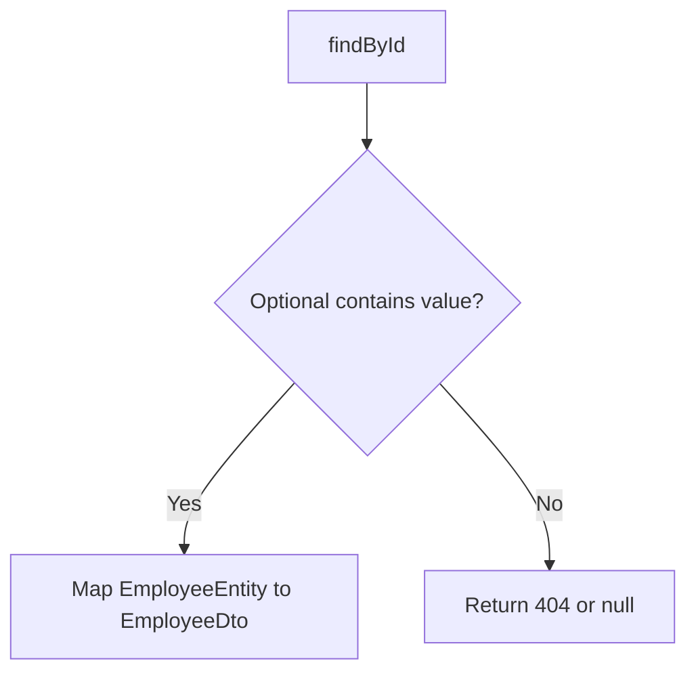
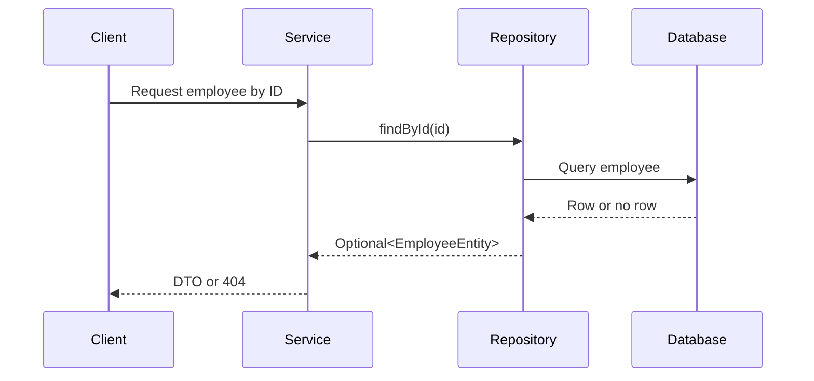

# `Optional` in Java

## Overview

`Optional<T>` is a container that may contain a value or may be empty. It makes the possibility of a missing value explicit and helps avoid accidental `NullPointerException` errors.

```java
Optional<EmployeeEntity> employee;
```

This means the variable may contain an `EmployeeEntity`, or it may contain nothing.

## Problem Statement

Without `Optional`, a repository lookup commonly returns `null` when an employee does not exist:

```java
EmployeeEntity employee = repository.findById(id); // may be null
```

The caller may forget to check for `null` and then call a method on it.

## Existing Flow

Spring Data repositories return `Optional` from `findById`:

```java
Optional<EmployeeEntity> employee = employeeRepository.findById(empId);
```

The result is not normally `null`. It is either:

- Present: it contains an employee.
- Empty: no employee exists with that ID.

## New Flow



## Folder Structure

```text
repository/
  EmployeeRepository.java  # Returns Optional<EmployeeEntity>
services/
  EmployeeService.java     # Handles the optional result
dto/
  EmployeeDto.java
```

## Request Flow



## Code Walkthrough

### Check with `isPresent` or `isEmpty`

```java
Optional<EmployeeEntity> employee = employeeRepository.findById(empId);

if (employee.isEmpty()) {
    return null;
}

return modelMapper.map(employee.get(), EmployeeDto.class);
```

`get()` extracts the contained value, but it must only be called after confirming that the value exists. Calling it on an empty `Optional` throws `NoSuchElementException`.

### Use `map` and `orElse`

```java
return employeeRepository.findById(empId)
        .map(entity -> modelMapper.map(entity, EmployeeDto.class))
        .orElse(null);
```

`map` runs only when an entity exists. `orElse` supplies the result when the `Optional` is empty.

### Throw an exception for a missing employee

```java
EmployeeEntity entity = employeeRepository.findById(empId)
        .orElseThrow(() -> new EmployeeNotFoundException(empId));
```

This is often preferable in a service layer when a missing employee is an error.

## Important APIs

| API | Meaning |
|---|---|
| `Optional.of(value)` | Creates an Optional for a non-null value |
| `Optional.ofNullable(value)` | Creates an Optional that may be empty |
| `Optional.empty()` | Creates an empty Optional |
| `isPresent()` | Checks whether a value exists |
| `isEmpty()` | Checks whether no value exists |
| `get()` | Extracts the value; unsafe if empty |
| `orElse(value)` | Uses a fallback value |
| `orElseGet(supplier)` | Lazily creates a fallback value |
| `orElseThrow(...)` | Throws when empty |
| `map(function)` | Transforms the contained value |

## Edge Cases

- Do not compare an Optional with `null`; check `isEmpty()` or use `map`.
- Do not call `get()` without checking first.
- `orElse(...)` evaluates its fallback immediately; use `orElseGet(...)` for expensive fallback creation.
- Do not use `Optional` for entity fields or method parameters without a clear reason. It is most commonly useful for return values.

## Common Mistakes

```java
if (employee == null) { }
```

This is usually wrong for a repository-returned Optional. The Optional itself should normally exist; it may simply be empty.

```java
employee.get();
```

This can throw an exception when empty. Prefer `map`, `orElse`, or `orElseThrow`.

## Performance Notes

`Optional` is primarily an API clarity and safety tool. It does not remove the database query and should not be used as a replacement for database constraints or validation.

## Interview Questions

1. Why does `findById` return `Optional`?
2. What happens when `get()` is called on an empty Optional?
3. What is the difference between `orElse` and `orElseGet`?
4. When should `orElseThrow` be used?
5. Why should Optional generally not be used as an entity field?

## Summary

`Optional` represents a value that may be missing. For employee lookup, handle the empty case explicitly and use `map`, `orElse`, or `orElseThrow` instead of blindly calling `get()`.
