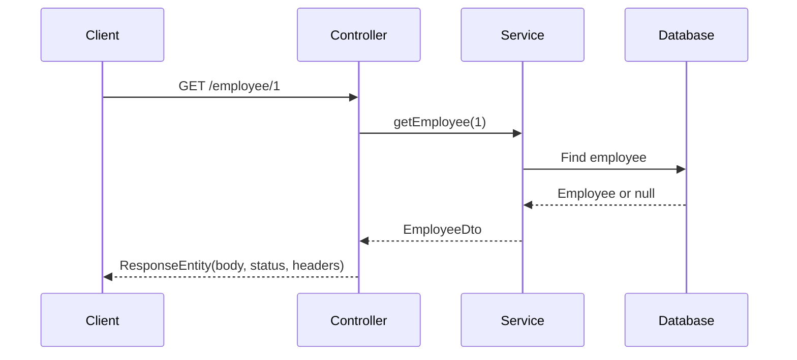
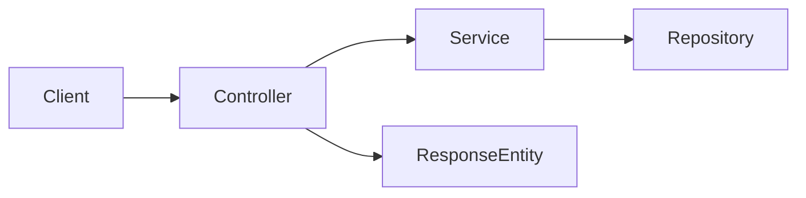

# ResponseEntity in Spring Boot

## Overview

`ResponseEntity<T>` represents the complete HTTP response returned by a controller:

- Response body
- HTTP status code
- HTTP headers

`T` is the type of the response body.

## Problem Statement

Returning only an object lets Spring serialize the body, but it gives less explicit control over the HTTP response. APIs often need to return different status codes, such as `200 OK`, `201 Created`, `404 Not Found`, or `400 Bad Request`.

## Existing Flow

```java
@GetMapping("/{id}")
public EmployeeDto getEmployee(@PathVariable Long id) {
    return employeeService.getEmployee(id);
}
```

Spring serializes the returned DTO and normally responds with `200 OK`.

## New Flow

```java
@GetMapping("/{id}")
public ResponseEntity<EmployeeDto> getEmployee(@PathVariable Long id) {
    EmployeeDto employee = employeeService.getEmployee(id);

    if (employee == null) {
        return ResponseEntity.notFound().build();
    }

    return ResponseEntity.ok(employee);
}
```

The controller now explicitly chooses the status code and response body.

## Folder Structure

```text
controller/
  Employee.java       # HTTP endpoints and response status decisions
services/
  EmployeeService.java
dto/
  EmployeeDto.java    # Response body shape
docs/
  ResponseEntity.md
```

## Request Flow



## Component Diagram



## Code Walkthrough

### Successful response

```java
return ResponseEntity.ok(employee);
```

This returns the employee as JSON with status `200 OK`.

### Created response

```java
return ResponseEntity.status(HttpStatus.CREATED).body(savedEmployee);
```

This is appropriate after successfully creating a resource with `POST`.

### Not-found response

```java
return ResponseEntity.notFound().build();
```

This returns `404 Not Found` with no body.

### Custom headers

```java
return ResponseEntity
        .ok()
        .header("X-Request-Id", requestId)
        .body(employee);
```

## Important APIs

| Method | Meaning |
|---|---|
| `ResponseEntity.ok(body)` | `200 OK` with a body |
| `ResponseEntity.status(HttpStatus.CREATED).body(body)` | `201 Created` with a body |
| `ResponseEntity.badRequest().build()` | `400 Bad Request` |
| `ResponseEntity.notFound().build()` | `404 Not Found` |
| `ResponseEntity.noContent().build()` | `204 No Content` |
| `ResponseEntity.status(...).headers(...).body(...)` | Full response control |

## Edge Cases

- Do not return `200 OK` when a requested employee does not exist; return `404 Not Found`.
- Do not return sensitive entity fields directly; prefer a DTO.
- Use `201 Created` for successful resource creation.
- Use `204 No Content` when an operation succeeds but has no response body.
- Avoid returning `null` as an ambiguous response.

## Common Mistakes

1. Using `ResponseEntity` everywhere without needing custom status or headers.
2. Returning `200 OK` for validation or database errors.
3. Returning JPA entities directly from public APIs.
4. Mixing response construction with business logic; the service should perform business work, while the controller should translate the result into HTTP.

## Performance Notes

`ResponseEntity` adds negligible overhead. It does not improve database performance; it only controls the HTTP response representation.

## Interview Questions

1. What does `ResponseEntity<T>` represent?
2. What is the difference between `ResponseEntity.ok()` and `ResponseEntity.status(HttpStatus.CREATED)`?
3. When should an API return `404 Not Found`?
4. Why should controllers often return DTOs instead of entities?
5. When is returning a plain object simpler than using `ResponseEntity`?

## Summary

Use `ResponseEntity<T>` when the endpoint needs explicit control over the HTTP status, headers, or body. If the endpoint always returns `200 OK` and has no special headers, returning the DTO directly is simpler.
